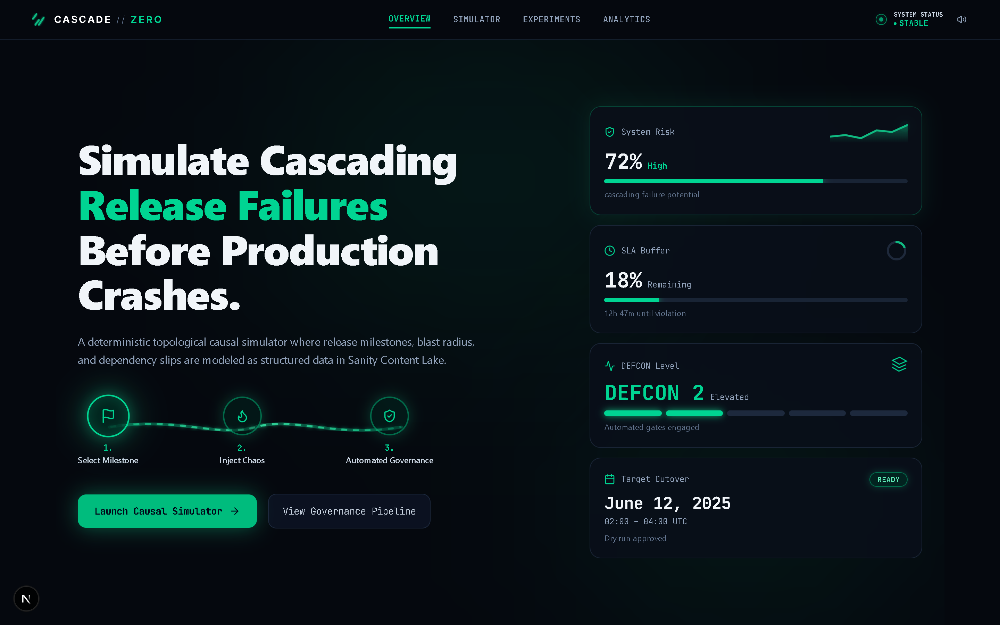
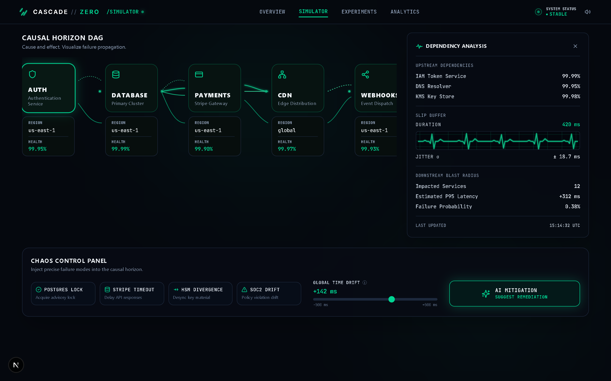
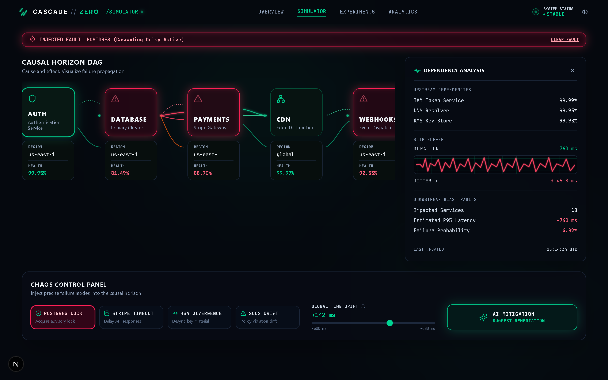
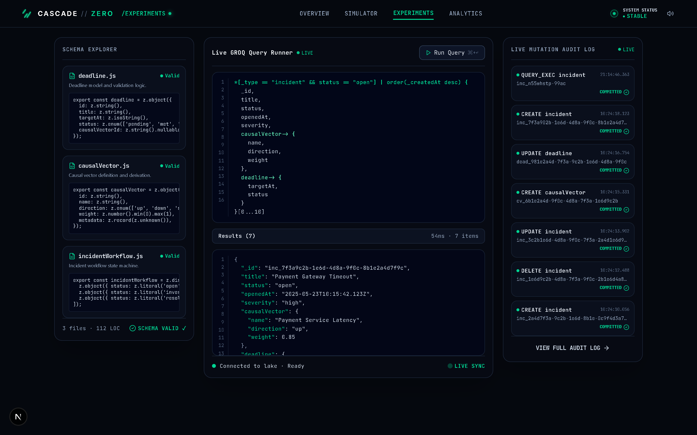
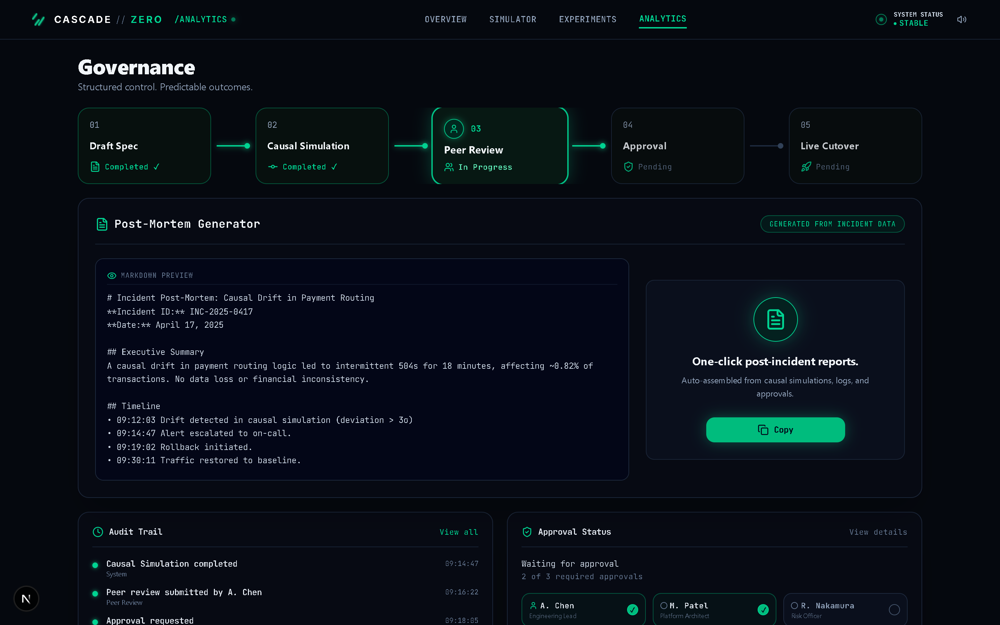

# ⚡ CASCADE-ZERO // Autonomous Causal Incident Simulator & War Room

> **DEFCON 1 Causal Disaster Simulator** where deadlines fight each other across Sanity Content Lake. Built for the **DEV Sanity Challenge (Path Two: Vibe-Code Something Strange)**.

[](https://nextjs.org/)
[](https://react.dev/)
[](https://www.sanity.io/)
[](https://x-tahosin.github.io/cascade-zero/)
[](LICENSE)

---

## 🌐 Live Deployment & Demo Links

- 🚀 **Interactive War Room:** [https://x-tahosin.github.io/cascade-zero/](https://x-tahosin.github.io/cascade-zero/)
- 🎛️ **Causal Simulator:** [https://x-tahosin.github.io/cascade-zero/simulator](https://x-tahosin.github.io/cascade-zero/simulator)
- ⚖️ **Governance State Machine:** [https://x-tahosin.github.io/cascade-zero/governance](https://x-tahosin.github.io/cascade-zero/governance)
- 🌊 **Sanity Lake Inspector:** [https://x-tahosin.github.io/cascade-zero/lake](https://x-tahosin.github.io/cascade-zero/lake)

---

## 🎯 The Strange Premise: Why Model Causality in Sanity?

Most project management and deadline trackers are passive to-do lists that quietly lie until release day.

**CASCADE-ZERO** inverts this: **what if milestones were structured, directed nodes in a live graph database—where slipping an upstream deadline causes a non-linear, cascading catastrophe down the dependency chain in real time?**

By leveraging **Sanity Content Lake** as a graph database and state engine rather than a traditional marketing CMS, CASCADE-ZERO models:
1. **Directional Causal Vectors:** Couplings between infrastructure cutovers and downstream compliance gates.
2. **Dynamic SLA Buffers:** Real-time calculation of blast radius and doomsday risk scores.
3. **Autonomous Sanity Workflows:** Automatic DEFCON escalation, downstream release locks, and human-in-the-loop intervention proposals.

---

## 📸 Interface & Live Production Screenshots

| Interactive War Room & Causal Graph | Real-time Causal Horizon Simulator |
| :---: | :---: |
|  |  |

| Chaos Monkey Fault Injection Active | Sanity Lake Schema & Live GROQ Runner |
| :---: | :---: |
|  |  |

| Incident Governance Workflow & Approvals |
| :---: |
|  |

---

## 🏗️ Architecture & Sanity Schema Design

CASCADE-ZERO treats content as code, graph edges, and state transitions.

```
                    ┌─────────────────────────┐
                    │  Sanity Content Lake    │
                    │  (Structured Data Core) │
                    └────────────┬────────────┘
                                 │
          ┌──────────────────────┼──────────────────────┐
          ▼                      ▼                      ▼
┌──────────────────┐   ┌──────────────────┐   ┌──────────────────┐
│ `deadline` Doc   │   │ `causalVector`   │   │`incidentWorkflow`│
│ - SLA Buffers    │   │ - Directed DAG   │   │ - DEFCON Levels  │
│ - Blast Radius   │   │ - Coupling Weight│   │ - Stage Machine  │
│ - Doomsday Weight│   │ - Non-linear Pen.│   │ - Audit Mutations│
└─────────┬────────┘   └─────────┬────────┘   └─────────┬────────┘
          │                      │                      │
          └──────────────────────┼──────────────────────┘
                                 │
                                 ▼
                     ┌───────────────────────┐
                     │ Causal Engine (Sim)   │
                     │ - Topological Sort    │
                     │ - Non-linear Cascade  │
                     │ - Web Audio Synth     │
                     └───────────────────────┘
```

### 1. `deadline` Document Schema
```typescript
export const deadlineSchema = {
  name: 'deadline',
  title: 'Horizon Deadline Milestone',
  type: 'document',
  fields: [
    { name: 'id', title: 'Milestone ID', type: 'string' },
    { name: 'title', title: 'Milestone Title', type: 'string' },
    { name: 'category', title: 'Category', type: 'string' },
    { name: 'targetHours', title: 'Target Hours (T+)', type: 'number' },
    { name: 'slaBufferMinutes', title: 'SLA Buffer (Minutes)', type: 'number' },
    { name: 'blastRadius', title: 'Downstream Blast Radius', type: 'number' },
    { name: 'doomsdayWeight', title: 'Doomsday Penalty Multiplier', type: 'number' }
  ]
};
```

### 2. `causalVector` Schema (Directed Graph Edge)
```typescript
export const causalVectorSchema = {
  name: 'causalVector',
  title: 'Causal Vector (DAG Edge)',
  type: 'document',
  fields: [
    { name: 'source', title: 'Upstream Dependency', type: 'reference', to: [{ type: 'deadline' }] },
    { name: 'target', title: 'Downstream Consumer', type: 'reference', to: [{ type: 'deadline' }] },
    { name: 'weight', title: 'Causal Coupling Weight', type: 'number' },
    { name: 'latencyPenalty', title: 'Non-linear Latency Multiplier', type: 'number' }
  ]
};
```

### 3. `incidentWorkflow` Schema (Governance State Machine)
```typescript
export const incidentWorkflowSchema = {
  name: 'incidentWorkflow',
  title: 'Release Incident Governance',
  type: 'document',
  fields: [
    { name: 'stage', title: 'Current Stage', type: 'string', options: { list: ['draft', 'simulating', 'peer-review', 'approved', 'deployed'] } },
    { name: 'defconLevel', title: 'System DEFCON', type: 'number' },
    { name: 'systemDoomsdayScore', title: 'Risk Probability (%)', type: 'number' },
    { name: 'auditTrail', title: 'Immutable Mutation Log', type: 'array', of: [{ type: 'object' }] }
  ]
};
```

---

## ⚡ Key Features

1. **Topological Causal Engine:** Real-time directed acyclic graph (DAG) recalculation using topological sort and exponential decay damping for downstream cascading delays.
2. **Playable Timeline Scrubber:** Drag the time slider across a 24-hour deployment window to visually see deadlines collapse in real time.
3. **Chaos Monkey Fault Injections:** 
   - *Postgres Shard Lock Contention* (+45m lag)
   - *HSM Key Rotation Desync* (+90m lag)
   - *Settlement Gateway Timeout* (+60m lag)
   - *Global Edge DNS Propagation Hang* (+120m lag)
4. **Autonomous Sanity Workflows:** Dynamic governance that elevates DEFCON from 5 (Normal) to 1 (Doomsday), freezes downstream cutovers, and dispatches incident mutations directly to Sanity Content Lake.
5. **Zero-Dependency Web Audio Synth:** Real-time procedural mission control audio synthesis (DEFCON klaxons, heartbeats, cascade alerts, resolution chimes) powered natively by the Web Audio API.

---

## 🛠️ Local Development & Quickstart

```bash
# Clone the repository
git clone https://github.com/x-tahosin/cascade-zero.git

# Enter project directory
cd cascade-zero

# Install dependencies
npm install

# Start local development server
npm run dev
```

Open [http://localhost:3000](http://localhost:3000) in your browser.

---

## 👥 Author & Community

- **Creator:** S M Tahosin ([@tahosin](https://dev.to/tahosin))
- **GitHub:** [@x-tahosin](https://github.com/x-tahosin)
- **Challenge:** [DEV Sanity Challenge (Path Two: Vibe-Code Something Strange)](https://dev.to/challenges/sanity-2026-09-16)

---

## 📄 License

This project is licensed under the [MIT License](LICENSE).
